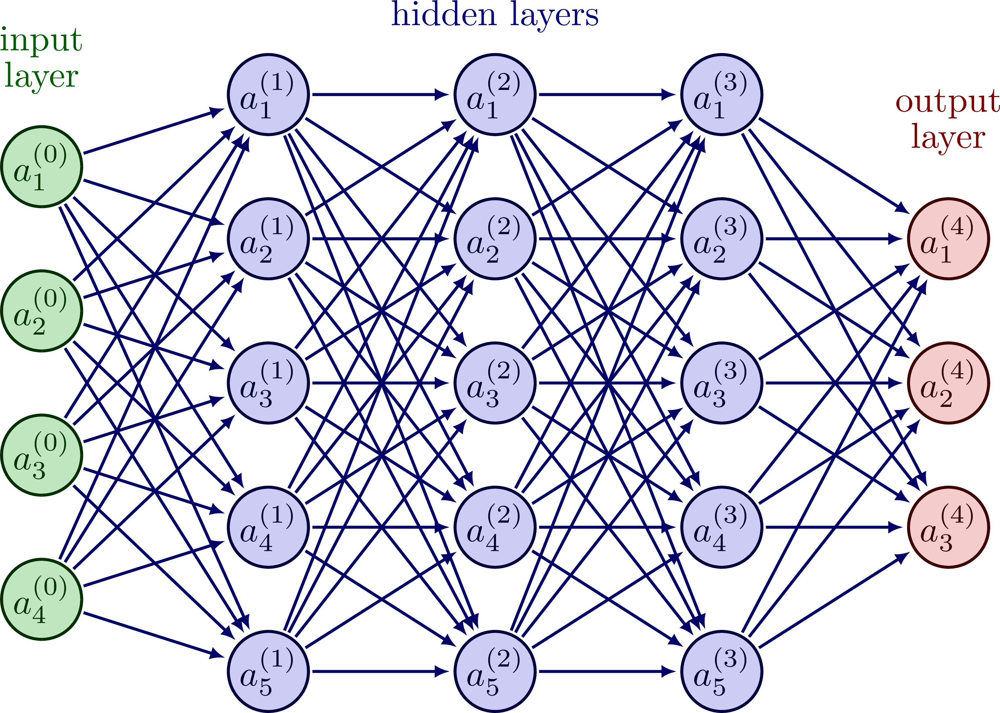
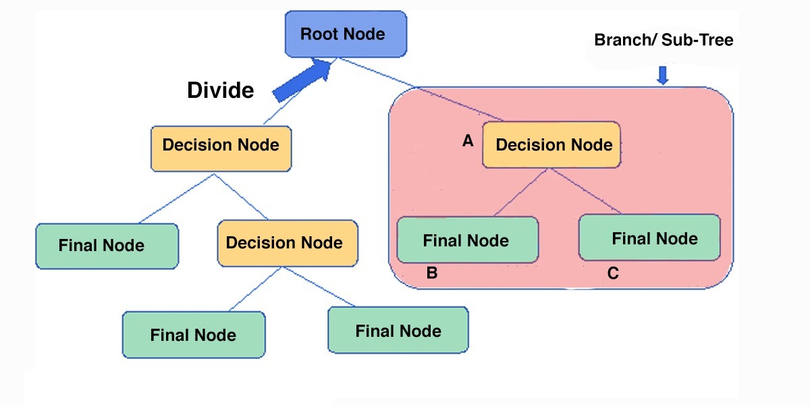
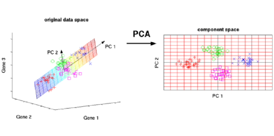

# Machine Learning

## Type Learning

### Aprendizaje semisupervisado

Semi-supervised learning is a learning method that occurs in ML when there are two data blocks with two different types of data in each of them: labeled* and unlabelled* data. In this way, the data is faced with two different phases:

1- A first where the labeled data is shown to the model so that it can identify the different interactions to which it will be exposed as well as given tools to solve it

2- A second where the model is confronted with the unlabeled data so that its resolution capacity for the proposed casuistry can be evaluated.

This type of learning model can be used to detect fraudulent transactions or to evaluate telephone conversations in order to extract customer interests (sentiment analysis), to give two examples.

### Aprendizaje no supervisado

Supervised learning is the one that only used unlabeled data to carry out its analyses. This type of model allows to execute more complex analyzes than those that we can find in supervised models because they are less restricted or regulated by results and protocols given previously, but at the same time they return more unpredictable results and reliability, a priori, lower than that which can be returned by other types of models that have labeled data in their analysis.

This type of learning is usually used for clustering, grouping and segmentation of data where the model itself finds and chooses the most significant common variables of the data that is delivered to it in order to return a subsequent grouping of the greatest possible similarity between the data that make up the model. the different clusters.

In turn, it is a type of learning of great value since it allows discovering relationships or behaviors between data that, prior to these analyses, were not known.

  
### Supervised Learning

Supervised learning is defined by its use of labeled datasets to train algorithms that to classify data or predict outcomes accurately. As input data is fed into the model, it adjusts its weights until the model has been fitted appropriately, which occurs as part of the cross validation process.

Supervised learning uses a training set to teach models to yield the desired output. This training dataset includes inputs and correct outputs, which allow the model to learn over time. The algorithm measures its accuracy through the loss function, adjusting until the error has been sufficiently minimized.

Supervised learning can be separated into two types of problems when data mining - regression and classification:

- **Regression**:
Used to understand the relationship between dependent and independent variables. It is commonly used to make projections, such as for sales revenue for a given business. Linear regression, logistical regression, and polynomial regression are popular regression algorithms.

- **Classification**:  
Uses an algorithm to accurately assign test data into specific categories. It recognizes specific entities within the dataset and attempts to draw some conclusions on how those entities should be labeled or defined. Common classification algorithms are linear classifiers, support vector machines (SVM), decision trees, k-nearest neighbor, and random forest.

Types of algorithms fr supervised machine learning:
- Linear Regression: is used to identify the relationship between a dependent variable and one or more independent variables and is typically leveraged to make predictions about future outcomes.
- Logistic Regression: while linear regression is leveraged when dependent variables are continuous, logistical regression is selected when the dependent variable is categorical, meaning they have binary outputs, such as "true" and "false" or "yes" and "no."
- Neural Networks
- Naive Bayes
- Support vector machine (SVM)
- K-nearest neighbor
- Random forest

### Reinforcement Learning (RL)
 Reinforcement Learning(RL) is a type of machine learning technique that enables an agent to learn in an interactive environment by trial and error using feedback from its own actions and experiences. It uses rewards and punishments as signals for positive and negative behavior
in the case of reinforcement learning the goal is to find a suitable action model that would maximize the total cumulative reward of the agent

*Dato etiquetado: Aquel conjunto de datos el cual trae una resolución al respecto de la casuística a la cual se les enfrenta. P.E: a la vista de un conjunto de datos bancarios de distintos clientes, se indica cuales están en disposición de recibir un crédito o no.*

*Dato no etiquetado: Aquel que contiene solo información al respecto del individuo/elemento analizado, pero no la resolución del conflicto que se le presenta al modelo en cuestión: Estos mismos datos de clientes previamente mencionados, pero sin tener la clasificación de apto/no apto realizada en el mismo conjunto de datos.*

 
## Model types

---
#### Aprendizaje Supervisado
- **Regression**:
In Machine Learning, we use various kinds of algorithms to allow machines to learn the relationships within the data provided and make predictions based on patterns or rules identified from the dataset. So, regression is a machine learning technique where the model predicts the output as a continuous numerical value

- **[Naive Bayesian Algorithm](https://www.javatpoint.com/machine-learning-naive-bayes-classifier#:~:text=Na%C3%AFve%20Bayes%20Classifier%20is%20one,the%20probability%20of%20an%20object.)**:
Applying Bayes' theorem, these algorithms classify values ​​as independent of any other data in the set under study, allowing a class or category to be predicted based on a predetermined set of characteristics using a probabilistic index.
This type of algorithm is one of the most implemented since, despite its simplicity, it allows highly complex data classifications.

[example mailing SPAM](https://medium.com/analytics-vidhya/email-spam-classifier-using-naive-bayes-a51b8c6290d4)

- **Artificial Neuronal Networks**:
An artificial neural network comprises a set of units that are in a series of layers that are in turn connected to adjoining layers, resembling the type of connections that are generated in biological systems such as neurons in the brain. These networks are interconnected sets of data that work together to solve specific problems.

---
#### Aprendizaje No Supervisado
- **Clustering**:
They are mainly used in unsupervised machine learning since it allows organizing and categorizing unlabeled data. This algorithm performs group searches within the data represented by a variable. It works iteratively to assign each data point to one of the groups represented in the variable based on the characteristics that were set as default.

- **Decision Tree**:
A decision tree is a very useful structural tool for choosing options based on pre-established managerial criteria. Similar to a flowchart, it uses a branching method to represent the possible outcomes of executing a decision. Within the tree, nodes are generated that represent specific variables and the results of the executed tests can be observed in the branches.

- **Análisis de Componentes Principales**:
PCA es un procedimiento estadístico que usa una transformación ortogonal para convertir un conjunto de observaciones de variables posiblemente correlacionadas en un conjunto de valores de variables linealmente no correlacionadas llamadas componentes principales. Análisis de componentes principales. 
Algunas de las aplicaciones de PCA incluyen compresión, simplificación de datos para un aprendizaje más fácil, visualización. Tenga en cuenta que el conocimiento del dominio es muy importante al elegir si seguir adelante con PCA o no. No es adecuado en los casos en que los datos son ruidosos (todos los componentes de PCA tienen una variación bastante alta).

