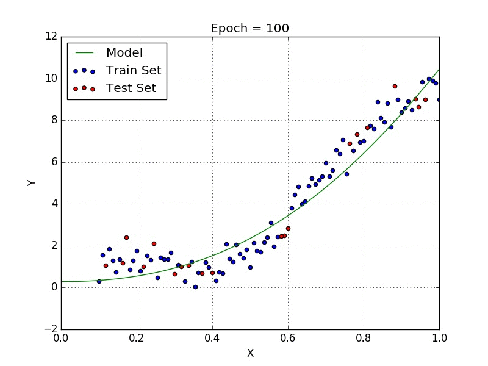
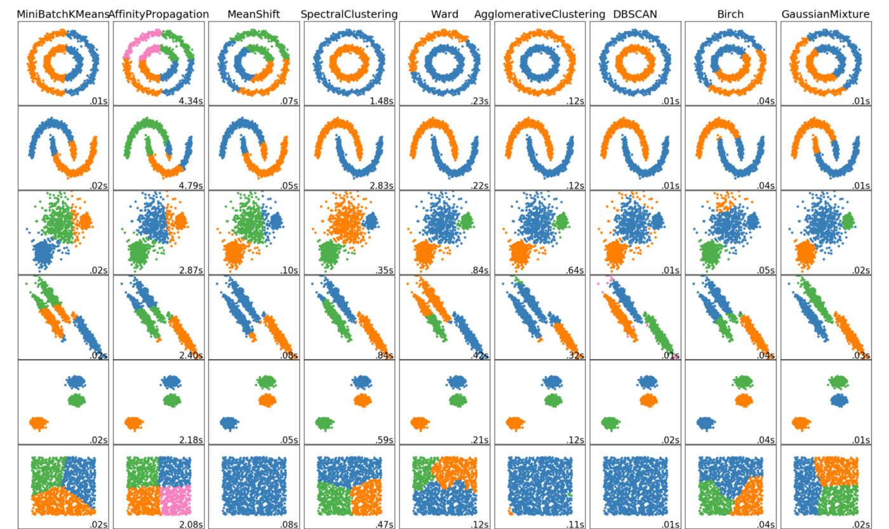

# Machine Learning

## Type Learning

*- Aprendizaje semisupervisado*

El aprendizaje semisupervisado es un método de aprendizaje que se da en ML cuando se disponen de dos bloques de datos con dos tipos de dato diferenciados en cada uno de ellos: datos etiquetados* y no etiquetaodos*. De esta forma se enfrenta a los datos a dos fases distintas:

1- Una primera donde se le muestra al modelo aquellos datos etiquetados para pueda identificar las distintas interacciones a las que va a ser expuesto así como se le da herramientas para resolverlo

2- Una segunda donde se enfrenta al modelo con los datos no etiquetados de manera que se pueda evaluar su capacidad de resolución para la casuística propuesta.

Este tipo de modelo de aprendizaje se puede usar para la detección de transacciones fraudulentas o para la evaluación de conversaciones teléfonicas en pos de extraer intereses del cliente (sentiment analysis), por poner dos ejemplos.

*- Aprendizaje no supervisado*

El aprendizaje supervisado es el cual solo utilizado dato no etiquetado para la realización de sus análisis. Este tipo de modelo permite ejecutar análisis más complejos que los que podemos encontrar en modelos supervisados debido a que se ven menos ceñidos o regulados por resultados y protocolos dados anteriormente, pero a su vez devuelven unos resultados más impredecibles y de una fiabilidad, a priori, menor que la que pueden devolver otro tipo de modelos que cuenten con datos etiquetados en su análisis.

Este tipo de aprendizaje suele usarse para la clusterización, agrupación y segmentación de datos donde el propio modelo encuentra y elige las variables más signficativas comunes de los datos que se le entregan para poder devolver una agrupación posterior de la mayor similitud posible entre los datos quer conforman los distintos clusters.

A su vez, es un tipo de aprendizaje de gran valía dado que permite descubrir relaciones o comportamientos entre datos que, previo a estos análisis, no se conocían.

*Dato etiquetado: Aquel conjunto de datos el cual trae una resolución al respecto de la casuística a la cual se les enfrenta. P.E: a la vista de un conjunto de datos bancarios de distintos clientes, se indica cuales están en disposición de recibir un crédito o no.
*Dato no etiquetado: Aquel que contiene solo información al respecto del individuo/elemento analizado, pero no la resolución del conflicto que se le presenta al modelo en cuestión: Estos mismos datos de clientes previamente mencionados, pero sin tener la clasificación de apto/no apto realizada en el mismo conjunto de datos.

  
2. Antonio
### Supervised Learning

Supervised learning is defined by its use of labeled datasets to train algorithms that to classify data or predict outcomes accurately. As input data is fed into the model, it adjusts its weights until the model has been fitted appropriately, which occurs as part of the cross validation process.

Supervised learning uses a training set to teach models to yield the desired output. This training dataset includes inputs and correct outputs, which allow the model to learn over time. The algorithm measures its accuracy through the loss function, adjusting until the error has been sufficiently minimized.

Supervised learning can be separated into two types of problems when data mining - regression and classification:

- **Regression**:
Used to understand the relationship between dependent and independent variables. It is commonly used to make projections, such as for sales revenue for a given business. Linear regression, logistical regression, and polynomial regression are popular regression algorithms.

- **Classification**:  
Uses an algorithm to accurately assign test data into specific categories. It recognizes specific entities within the dataset and attempts to draw some conclusions on how those entities should be labeled or defined. Common classification algorithms are linear classifiers, support vector machines (SVM), decision trees, k-nearest neighbor, and random forest.

Types of algorithms fr supervised machine learning:
- Linear Regression: is used to identify the relationship between a dependent variable and one or more independent variables and is typically leveraged to make predictions about future outcomes.
- Logistic Regression: while linear regression is leveraged when dependent variables are continuous, logistical regression is selected when the dependent variable is categorical, meaning they have binary outputs, such as "true" and "false" or "yes" and "no."
- Neural Networks
- Naive Bayes
- Support vector machine (SVM)
- K-nearest neighbor
- Random forest

### Reinforcement Learning (RL)
 Reinforcement Learning(RL) is a type of machine learning technique that enables an agent to learn in an interactive environment by trial and error using feedback from its own actions and experiences. It uses rewards and punishments as signals for positive and negative behavior
in the case of reinforcement learning the goal is to find a suitable action model that would maximize the total cumulative reward of the agent

 
## Model types

- **Algoritmos de regresión**:
Cuando se requieren realizar tareas de regresión, el programa de machine learning debe realizar estimaciones y comprender a profundidad las relaciones existentes entre las variables que debe estudiar.
En este caso el análisis de regresión debe enfocarse en una variable dependiente y una serie de variables diferentes de tipo independientes. Al ejecutarse el algoritmo puede realizar pronósticos o predicciones de una forma muy eficiente.

- **Algoritmos Bayesianos**:
Aplicando el teorema de Bayes, estos algoritmos clasifican los valores como independientes de cualquier otro dato en el conjunto en estudio permitiendo predecir una clase o categoría en función de un conjunto predeterminado de características utilizando un índice probabilístico.
Este tipo de algoritmo es uno de los más implementados ya que a pesar de su simplicidad permite realizar clasificaciones de datos de alta complejidad.

- **Algoritmos de agrupación**:
Principalmente son utilizados en el aprendizaje automático de tipo no supervisado ya que permite organizar y categorizar datos no etiquetados. Este algoritmo ejecuta búsquedas de grupos dentro de los datos representados por una variable. Funciona de manera iterativa para asignar cada punto de datos a uno los grupos representados en la variable tomando como base las características que se establecieron como predeterminadas.

- **Algoritmos de árbol de decisión**:
Un árbol de decisión es una herramienta estructural muy útil para elegir opciones en base a criterios gerenciales preestablecidos. Similar a un diagrama de flujo, utiliza un método de bifurcación para representar los resultados posibles al ejecutar una decisión. Dentro del árbol se generan nodos que representan variables específicas y en las ramas se puede observar el resultado de las pruebas ejecutadas.

- **Algoritmos de redes neuronales**:
Una red neuronal artificial comprende un conjunto de unidades que se encuentran en una serie de capas que a su vez están conectadas a capas anexas, asemejando el tipo de conexiones que se generan en sistema biológicos como las neuronas del cerebro. Estás redes son conjuntos interconectados de datos que trabajan en conjunto para darle solución a problemas específicos.

- **Algoritmos de aprendizaje profundo**:
Los algoritmos de Deep Learning son aquellos que ejecutan datos a través de capas compuestas por varias capas de algoritmos de redes neuronales en las que pasan una representación simplificada de los datos obtenidos a la capa siguiente. Estos algoritmos funcionan de forma fluida con conjuntos de datos estructurados.
